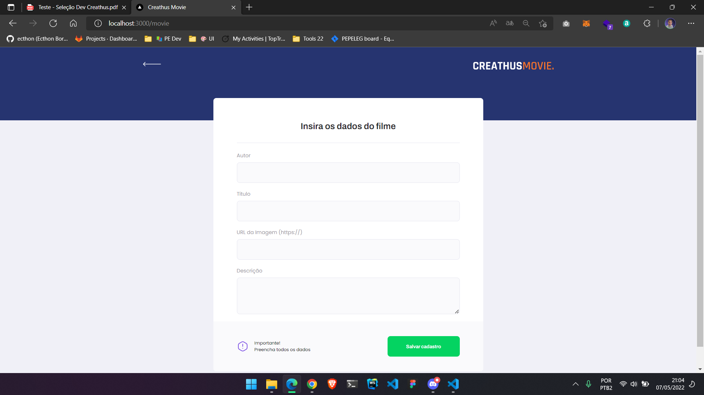
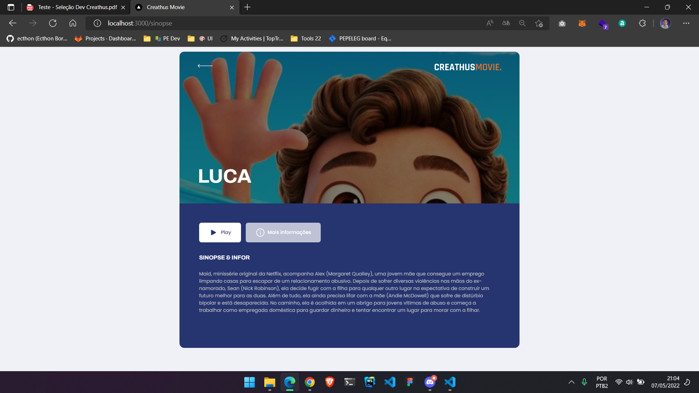

    

    

    

 

# Creathus Movies

## Sobre

Desafio - Desenvolver uma webpage para listagem de filmes

O projeto consiste no desenvolvimento de uma mini plataforma colaborativa de catálogo de filmes que permita 
o usuário visualizar os últimos filmes adicionados e visualizar a sinopse do filme. Nesta plataforma 
colaborativa, deverá existir também uma página administrativa para cadastro de filme com título, descrição e 
upload de imagem.

## Tecnologies

- Front-End
-- React.js
-- Typescript
-- Styled Components
-- Axios (Acessar rotas API)
-- Mirage.js (Criar fake API)
-- react-router-dom (criar rotas do front-end)
-- Vercel (Hospedagem)

- Back-End
-- Prisma (ORM)
-- Postgres
-- Node.js

## Rodando projeto em sua máquina

- Front-End

- 1. Faça o clone do projeto em: `git clone https://github.com/ecthon/creathus-movie.git`
- 2. Instale as depedências do projeto com o comando: `yarn`
- 3. Execute o projeto: `yarn start`
- 4. Acessando projeto em: `http://localhost:3000`

## Rotas Front-End
- Home: `http://localhost:3000/`
- Sinopse: `http://localhost:3000/sinopse`
- Register: `http://localhost:3000/movie`

 - Back-End

 - 1. Você precisará ter o Postgres instalado em sua máquina;
 - 2. Crie um banco como o nome: `movies_db`
 - 3. Faça o clone do projeto em: `git clone https://github.com/ecthon/backend-creathusmovies.git`
 - 4. Instale as depedências do projeto com o comando: `yarn`
 - 5. Execute o comando `yarn prisma migrate dev` para gerar a tabela do banco
 - 6. Execute o comando `yarn start` para rodar a aplicação 
## Links

- [Página publicada](https://creathus-movie-d2ww98mil-ecthon.vercel.app/)
- [Ecthon Linkedin](https://www.linkedin.com/in/ecthon/)

Com todo 💚 por [Ecthon](https://github.com/ecthon).
